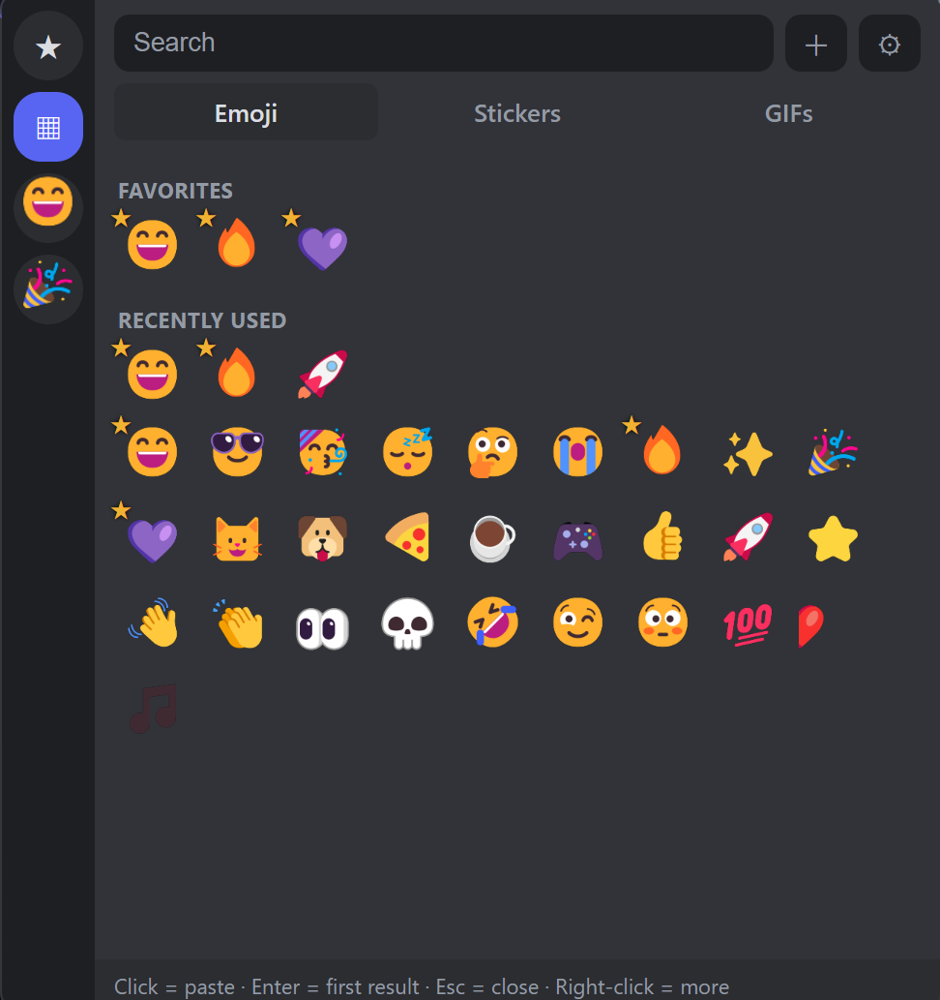
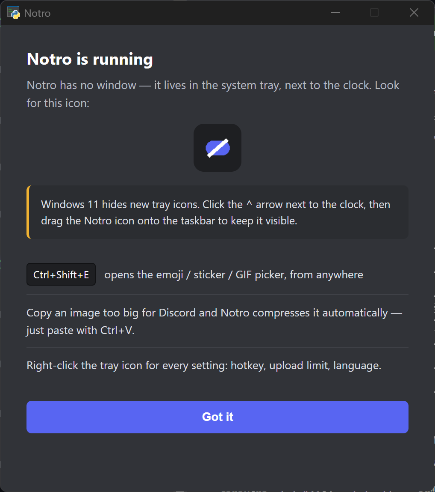

# Notro

<p align="center">
  
</p>

<p align="center">
  
  
  
</p>

<p align="center"><a href="README.md">English</a> | <a href="README.ko.md">한국어</a> | <b>日本語</b> | <a href="README.zh.md">中文</a> | <a href="README.es.md">Español</a></p>

Discord の無料ユーザー向けの小さな Windows トレイアプリです。無料アップロード上限（10 MB）を超えるクリップボード画像を**自動圧縮**し、Nitro が塞いだ**絵文字・スタンプ・GIF ピッカー**（ホットキーのポップアップ）を **Discord クライアントを一切改変せずに**提供します。<kbd>Ctrl</kbd>+<kbd>V</kbd> で貼り付けるだけ。

<p align="center">
  
</p>

## 仕組み（自動圧縮）

1. システムトレイに常駐してクリップボードを監視します。
2. 新しい画像がコピーされると、貼り付け時に **Discord が生成する PNG の容量**を計算します。
3. **10 MB 以下なら何もしません**（そのまま貼り付け可能）。
4. 上限を超える場合は **WebP → JPEG** の順に品質を下げて約 9.5 MB 以下に収め、それでも大きければ**解像度を段階的に縮小**します。
5. 圧縮した画像は**ファイルとして**クリップボードに入るので、Discord で <kbd>Ctrl</kbd>+<kbd>V</kbd> すればファイル添付としてアップロードされます。結果はトレイ通知で知らせます。

> ディスク上の元のキャプチャファイルには触れません。クリップボードだけを置き換えます。

## ピッカー（v2.0）

Discord で入力中に <kbd>Ctrl</kbd>+<kbd>Shift</kbd>+<kbd>E</kbd>（トレイから変更可能）を押すと、カーソル付近に Discord 風のダークなポップアップが開き、**絵文字 / スタンプ / GIF** の 3 タブが表示されます。

- **追加:** **＋** を押して Discord の*「リンクをコピー」*で得た絵文字 URL を貼り付けるか、画像ファイルをピッカーにドラッグ＆ドロップするか、**監視フォルダー**（⚙）を追加すると、その中の PNG/GIF/WebP/APNG が現在のタブに自動表示されます。
- **使用:** クリックするとピッカーが閉じて Discord にフォーカスが戻り、メッセージ欄に画像が添付されます。**送信（Enter）はご自身で押します。** 右クリックで「リンクとして貼り付け」（CDN 項目）や削除ができます。
- 動く APNG スタンプは登録時に GIF へ自動変換します（Discord はアップロードされた APNG を再生しないため）。
- 名前・キーワード検索、「最近使用」欄に対応。
- 上限を超える項目: 静止画像は自動圧縮、大きすぎる GIF は警告付きでそのまま送信します。

**ToS に配慮した設計:** Notro は Discord クライアントにパッチを当てず、アカウントやトークンにも一切触れません（セルフボットではありません）。クリップボードの準備とローカルな <kbd>Ctrl</kbd>+<kbd>V</kbd> 入力だけを行います — Windows の絵文字パネル（<kbd>Win</kbd>+<kbd>.</kbd>）と同じ種類の入力自動化です。正直なトレードオフ: 受信者にはネイティブのインライン絵文字ではなく、画像添付またはリンク埋め込みとして表示されます。

**WebView2 ランタイム**が必要です（Windows 11 に内蔵）。ない場合はピッカーのみ無効になり、圧縮機能はそのまま動作します。

## ダウンロードと実行（推奨）

[**Releases**](../../releases) ページから最新の `NotroSetup.exe` を入手して実行してください。`%LOCALAPPDATA%\Programs\Notro` にインストールされ（管理者権限不要）、スタートメニューとデスクトップのショートカットが作成されます。アンインストールは **設定 → アプリ** またはスタートメニューからいつでも可能です。

- トレイに常駐します。アイコンを右クリックすると: ピッカーを開く、ピッカーのホットキー変更、監視の停止/再開、最近の履歴、アップロード上限（10/50/500 MB）の切り替え、言語変更、出力フォルダーを開く、自動起動の有効化、終了。
- **自動起動は既定でオフ（opt-in）** です。必要ならトレイメニューの*「Windows 起動時に実行」*をオンにしてください。
- 同時に実行できるインスタンスは 1 つだけです。

> ⚠️ この EXE は**コード署名がない**ため、Windows SmartScreen や一部のウイルス対策ソフトが警告・誤検知することがあります。SmartScreen では*「詳細情報 → 実行」*をクリックするか、下記のソースから直接実行してください。

## 初回起動 — どこにある？

Notro には**ウィンドウがありません**。インストール後は静かに起動し、**システムトレイ**
（画面右下、時計の横）に常駐します。

> **Windows 11 は新しいトレイアイコンを既定で隠します。** Notro が見当たらない場合は、
> 時計の横の **`^`** をクリックし、**Notro のアイコンをタスクバーにドラッグ**して表示
> させてください。

そのあとは:

- どこでも <kbd>Ctrl</kbd>+<kbd>Shift</kbd>+<kbd>E</kbd> を押すとピッカーが開きます。
- Discord には大きすぎる画像をコピーすると自動で圧縮されます — そのまま
  <kbd>Ctrl</kbd>+<kbd>V</kbd> で貼り付けてください。
- **トレイアイコンを右クリック**すると、すべての設定（ホットキー、アップロード上限、
  言語 …）にアクセスできます。

初回起動時には**案内ウィンドウ**が開き、以上の内容を説明します — 探すべきトレイアイコンの
画像も表示されます。閉じても Notro はトレイで動き続けます。

<p align="center">
  
</p>

## ソースから実行（開発用）

```sh
pip install -r requirements.txt
pythonw notro.py
```

Windows で **Python 3.10 以上**が必要です。

## EXE を自分でビルド

```sh
build.bat
```

出力: `dist\Notro.exe`。Python 3.10+ が必要です（スクリプトが PyInstaller をインストールします）。

## 設定

`notro_app/config.py`（上限）と `notro_app/compress.py`（品質段階）の値を編集します:

| 設定 | 既定値 | 説明 |
|---|---|---|
| `LIMIT_MB` | 10 | 既定のアップロード上限（MB）— トレイの**アップロード上限**メニューで 10/50/500 を選択可能 |
| `SAFETY` | 0.95 | 安全マージン（約 9.5 MB を目標） |
| `WEBP_QUALITIES` | 90〜50 | WebP の品質段階 |
| `MIN_SCALE` | 0.4 | 縮小の下限 |

## 補足

- 圧縮ファイルは `%TEMP%\Notro` に書き込まれ、1 日経過後に自動削除されます。
- 上限より大きい画像**ファイル**をコピー（<kbd>Ctrl</kbd>+<kbd>C</kbd>）した場合も同様に圧縮されます。
- **対応言語:** English・한국어・日本語・中文(简体)・Español。Windows の言語を自動検出し、トレイの**言語**メニューでいつでも切り替えられます。

## 開発

```sh
pip install -r requirements-dev.txt
pytest
```

## ライセンス

[MIT](LICENSE)。

> Notro は非公式ツールであり、**Discord Inc. と提携・承認・スポンサー関係にはありません。**「Discord」は Discord Inc. の商標です。
