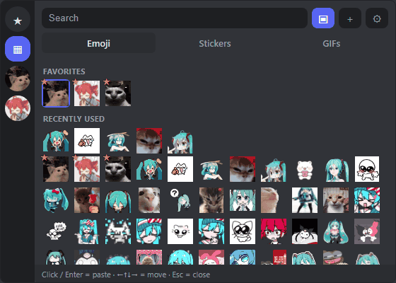

<p align="center">
  
</p>

<h1 align="center">Notro</h1>

<p align="center">
  <b>Nitro なしでカスタム絵文字と大きなファイルを — Discord クライアントには一切触れずに。</b>
</p>

<p align="center">
  <a href="../../releases/latest"></a>
  <a href="../../releases"></a>
  
  <a href="LICENSE"></a>
</p>

<p align="center"><a href="README.md">English</a> | <a href="README.ko.md">한국어</a> | <b>日本語</b> | <a href="README.zh.md">中文</a> | <a href="README.es.md">Español</a></p>

---

Discord が課金対象にしている 2 つのことを、アプリの外側から解決します。

- **画像が 14MB あるのに無料の上限は 10MB。** コピーした瞬間に Notro が縮小して
  クリップボードへ戻します。あとは <kbd>Ctrl</kbd>+<kbd>V</kbd> を押すだけです。
- **カスタム絵文字をどこでも使いたい。** <kbd>Ctrl</kbd>+<kbd>Shift</kbd>+<kbd>E</kbd> を
  押して選べば、入力欄に入ります。

**パッチも、インジェクションも、ログインもしません。** Notro はクリップボードを準備して
<kbd>Ctrl</kbd>+<kbd>V</kbd> を代わりに押すだけのトレイアプリです — Windows の絵文字パネル
(<kbd>Win</kbd>+<kbd>.</kbd>) と同じ種類の入力自動化です。Discord クライアントを改変せず、
アカウントやトークンには一切触れません。正直なトレードオフはこうです: 受け取る側には
ネイティブのインライン絵文字ではなく画像の添付として見えます。

<p align="center">
  
</p>

<p align="center"><sub>実際の UI と実際のライブラリ — 入力に応じて絞り込み、方向キーで移動、Enter で貼り付け。</sub></p>

<p align="center">
  <a href="../../releases/latest"><b>⬇ NotroSetup.exe をダウンロード</b></a><br>
  <sub>管理者権限は不要。ユーザーフォルダーにインストールされ、設定 → アプリ から削除できます。</sub>
</p>

---

## ピッカー

どこでも <kbd>Ctrl</kbd>+<kbd>Shift</kbd>+<kbd>E</kbd> を押すと、カーソルの近くに暗い
ポップアップが開きます。タブは **絵文字 / スタンプ / GIF** の 3 つです。

**本物の絵文字と同じ大きさで出ます。** Discord は添付画像を元のピクセルサイズのまま描画
します。そのため 20×20 の GIF と 1080×1080 の PNG が混在するライブラリでは、一方は
ごま粒のように、もう一方は写真のように貼られてしまいます。Notro は貼り付ける直前に長辺を
揃えます — 絵文字は **48px**（ジャンボなカスタム絵文字と同じ大きさ）、スタンプは
**160px**、GIF は元のまま。**ライブラリのファイルは変更せず**、クリップボードに載る複製
だけを調整します。

**絵文字の追加** — *「リンクをコピー」* の URL を貼り付けるか、メッセージから絵文字を
そのままコピーしたときに得られる `<:名前:id>` テキストを入れるか、画像ファイルをドラッグ
&ドロップするか、**監視フォルダー**を指定するか、あるいは `%APPDATA%\Notro\assets` の下に
フォルダーを作って入れるだけでも、登録作業なしにコレクションになります。

**探し方** — 名前とキーワードで検索できます（**韓国語の初声検索**にも対応: `ㅁㅋ` で
`미쿠` が見つかります）。お気に入りと最近使ったものが上に残ります。

**マウスなしで** — 方向キーで移動、<kbd>Enter</kbd> で貼り付け、<kbd>Esc</kbd> で閉じる。
ホットキーを押したあとはキーボードから手を離す必要がありません。

<details>
<summary>ピッカーの細かな動作</summary>

- 項目を右クリック → 名前とキーワードの編集、コレクションの移動、リンクとして貼り付け
  （URL で追加した項目）、削除。
- 同じタブ・コレクションに既にある画像を再び追加しようとすると、黙って重複させずに知らせます。
- 動く APNG スタンプは登録時に GIF へ変換されます — Discord がアップロードされた APNG を
  再生しないためです。
- クリップボードボタンで現在の画像を **キャプチャ** コレクションに直接保存できます。
  新しいクリップボード画像を自動保存する設定もあり、初期値はオフです。
- ウィンドウはサイズ変更でき、その大きさを（モニターの DPI も考慮して）記憶します。
- 上限を超える項目: 静止画は自動的に圧縮し、大きすぎる GIF は警告つきでそのまま送ります。
- 貼り付けたあと <kbd>Enter</kbd> まで代わりに押す自動送信オプションがあります — 初期値はオフ。

</details>

## 自動圧縮

Notro はクリップボードを見張っています。新しい画像が現れると **Discord が実際に生成する
PNG の容量** を計算し、上限内なら何もしません。超えていれば WebP → JPEG の順に再エンコード
して品質を、それでも足りなければ解像度を下げ、約 9.5MB 以下に収めた結果を **ファイルとして**
クリップボードに載せます。<kbd>Ctrl</kbd>+<kbd>V</kbd> でそのまま添付されます。

> ディスク上の元ファイルには一切触れません — 置き換えるのはクリップボードだけです。

上限はトレイから **10 / 50 / 500MB**（無料・Nitro Basic・Nitro）に切り替えられます。

## 動画クリップ

大きすぎるゲームクリップをコピーすると、Notro はまず確認し、どうなるかを示します:

```
52MB · 1:12 · 1080p60  →  約 9.5MB · 480p30
```

同じウィンドウで **範囲を切り出し**（`開始 – 終了`）**音声を外す** ことができ、入力するたびに
予測が更新されます。これはどんなエンコーダー設定よりも効きます: 30 秒の 1080p60 の映像は
まるごとだと **1080p30** まで落ちますが、実際に必要だった 7 秒だけ残せば **1080p60** を
保てます。

**ffmpeg は同梱しません。** 初めて動画を圧縮するときに必要な分だけ取得し（約 30MB、
SHA-256 検証つき）、`PATH` に既にあればそれを使います。360p でも上限に収まらないクリップは、
モザイクを作る代わりに正直に無理だと伝えます。

## インストール

**[`NotroSetup.exe`](../../releases/latest)** をダウンロードして実行してください。管理者権限は
不要で、`%LOCALAPPDATA%\Programs\Notro` にインストールされます。

> ⚠️ まだ **コード署名がない** ため、SmartScreen が「発行元不明」と警告します —
> *詳細情報 → 実行* を押してください。リリースごとに `NotroSetup.exe.sha256` を同梱している
> ので、ダウンロードしたものを正確に検証できますし、[ソースからビルド](#ソースから実行ビルド設定)
> することもできます。詳しくは [SECURITY.md](SECURITY.md#code-signing) と
> [コード署名ポリシー](CODE_SIGNING.md) をご覧ください。

**Windows 10 の方へ:** ピッカーには Microsoft Edge WebView2 ランタイムが必要です
（Windows 11 には標準搭載）。無い場合はインストーラーが取得します。無くてもピッカーが
無効になるだけで、圧縮は動作します。

### どこに行った？

Notro に **メインウィンドウはありません** — 時計の横のトレイで動作します。**Windows 11 は
新しいトレイアイコンを既定で隠す** ので、見当たらないときは **`^`** をクリックして Notro の
アイコンをタスクバーへドラッグしてください。

<p align="center">
  
</p>

残りはすべてトレイアイコンの右クリックにあります: ピッカーのホットキー、一時停止、最近の
処理履歴、アップロード上限、言語、出力フォルダー、Windows 起動時の自動実行（**既定はオフ**）。

## プライバシー

Notro はクリップボードを監視するので、その扱いを明らかにしておきます。

- **コピーした内容がどこかへ送信されることはありません。** テレメトリー、解析、クラッシュ
  レポート、アカウント — どれもありません。
- **頼まれない限り保存もしません。** キャプチャの自動保存は既定でオフです。
- 外部との通信はちょうど **4 か所** だけで、すべて文書化されています: GitHub（更新確認と
  インストーラー、SHA-256 検証）、`cdn.discordapp.com`（リンクで絵文字を追加するときだけ）、
  PyPI（初めて動画を圧縮するときの ffmpeg 取得、こちらも SHA-256 検証）。
- アンインストールしても **ライブラリは意図的に残します**（`%APPDATA%\Notro`）。再インストール
  しても絵文字を失わないようにするためです。

ファイルの保存場所まで含めた詳細は [SECURITY.md](SECURITY.md) にあります。

## 言語

English、한국어、日本語、中文(简体)、Español — Windows の言語を自動判別し、トレイから
いつでも切り替えられます。

<details>
<summary><a id="ソースから実行ビルド設定"></a>ソースから実行・ビルド・設定</summary>

```sh
pip install -r requirements.txt
pythonw notro.py           # 実行
build.bat                  # dist\Notro.exe をビルド
```

Windows と Python 3.10 以上が必要です。

圧縮の挙動は `notro_app/config.py` と `notro_app/compress.py` にあります:

| 設定 | 既定値 | 説明 |
|---|---|---|
| `LIMIT_MB` | 10 | アップロード上限 — トレイメニューで 10/50/500 も選べます |
| `SAFETY` | 0.95 | 安全マージン（約 9.5MB を目標） |
| `WEBP_QUALITIES` | 90–50 | WebP の品質段階 |
| `MIN_SCALE` | 0.4 | 解像度縮小の下限 |

テスト:

```sh
pip install -r requirements-dev.txt
pytest
```

</details>

## ライセンス

[MIT](LICENSE)。同梱しているサードパーティ製コンポーネントとそれぞれのライセンスは —
LGPL-3.0 の pystray を含めて — [THIRD-PARTY-NOTICES.md](THIRD-PARTY-NOTICES.md) に
まとめてあります。

> Notro は非公式のツールであり、**Discord Inc. と提携・後援・承認関係にありません。**
> 「Discord」は Discord Inc. の商標です。
