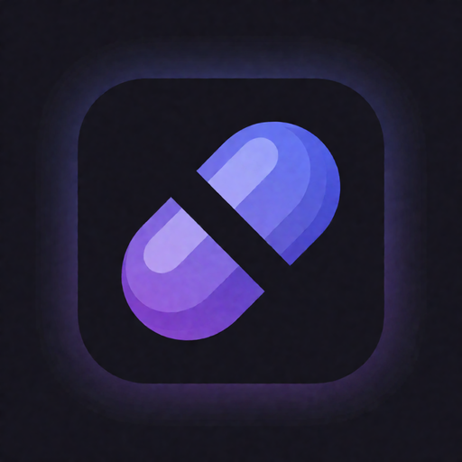
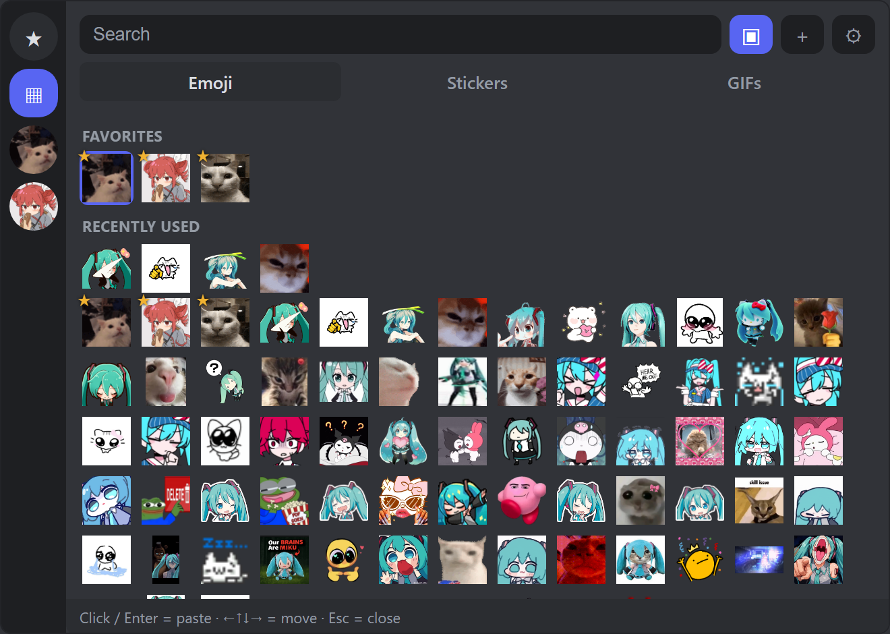
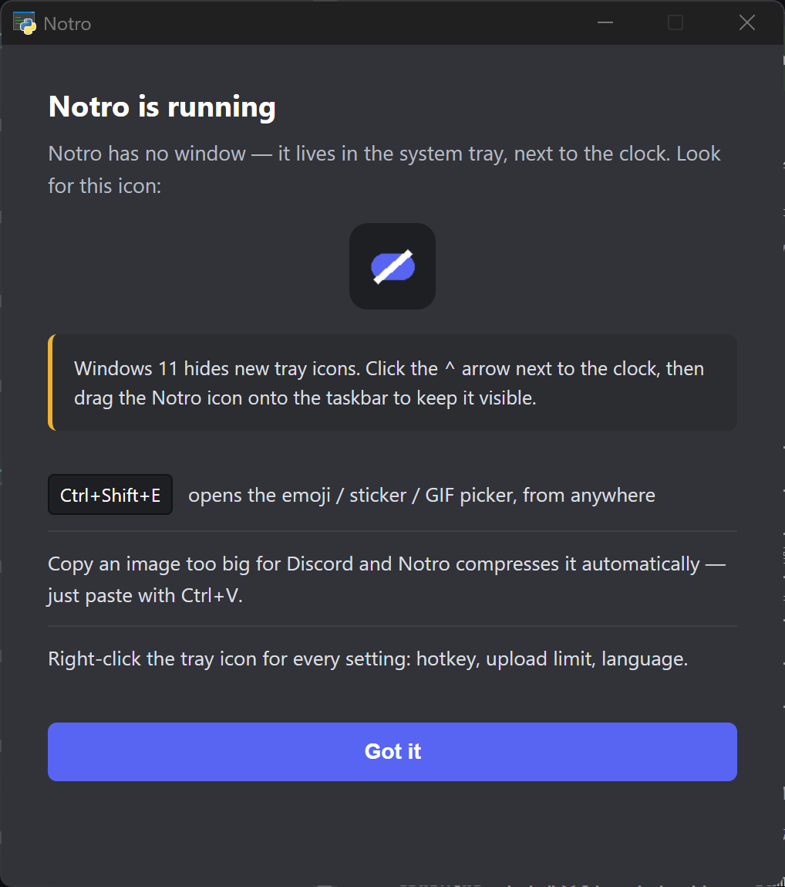

<p align="center">
  
</p>

<h1 align="center">Notro</h1>

<p align="center">
  <b>Custom emoji and big files on Discord — without Nitro, and without touching the Discord client.</b>
</p>

<p align="center">
  <a href="../../releases/latest"></a>
  <a href="../../releases"></a>
  
  <a href="LICENSE"></a>
</p>

<p align="center"><b>English</b> | <a href="README.ko.md">한국어</a> | <a href="README.ja.md">日本語</a> | <a href="README.zh.md">中文</a> | <a href="README.es.md">Español</a></p>

---

Two things Discord charges for, solved from outside the app:

- **Your image is 14 MB and the free limit is 10 MB.** Notro notices the moment you copy
  it, shrinks it, and puts it back on your clipboard. You just press <kbd>Ctrl</kbd>+<kbd>V</kbd>.
- **You want to use custom emoji anywhere.** Press <kbd>Ctrl</kbd>+<kbd>Shift</kbd>+<kbd>E</kbd>,
  pick one, and it lands in the message box.

**Nothing is patched, injected, or logged into.** Notro is a tray app that prepares your
clipboard and presses <kbd>Ctrl</kbd>+<kbd>V</kbd> for you — the same kind of input
automation as the Windows emoji panel (<kbd>Win</kbd>+<kbd>.</kbd>). It never modifies the
Discord client and never sees your account or token. The honest trade-off: recipients see
your emoji as image attachments, not as native inline emoji.

<p align="center">
  
</p>

<p align="center">
  <a href="../../releases/latest"><b>⬇ Download NotroSetup.exe</b></a><br>
  <sub>No admin rights. Installs to your user folder. Uninstall from Settings → Apps.</sub>
</p>

---

## The picker

<kbd>Ctrl</kbd>+<kbd>Shift</kbd>+<kbd>E</kbd> anywhere opens a dark popup at your cursor
with **Emoji / Stickers / GIFs** tabs.

**They come out the size real emoji are.** Discord draws an attachment at its native pixel
size, so a library holding a 20×20 GIF next to a 1080×1080 PNG would paste one as a speck
and the other as a full picture. Notro normalizes the longest edge just before pasting —
**48 px** for emoji (the size of a jumbo custom emoji), **160 px** for stickers, original
for GIFs. Your library files are never modified; only the copy on the clipboard is resized.

**Getting emoji in** — paste a *"Copy Link"* URL, or the `<:name:id>` text you get by
copying an emoji straight out of a message; drag and drop image files; point Notro at a
**watched folder**; or just drop a folder into `%APPDATA%\Notro\assets` and it becomes a
collection with no registration step at all.

**Finding them again** — search by name or keyword, including **Korean initial consonants**
(`ㅁㅋ` finds `미쿠`). Favorites and a recently-used row stay at the top.

**Without the mouse** — arrow keys move through the grid, <kbd>Enter</kbd> pastes,
<kbd>Esc</kbd> closes. After the hotkey your hands never leave the keyboard.

<details>
<summary>More picker behaviour</summary>

- Right-click an item to rename it, edit its keywords, move it to another collection,
  paste it as a link (for items added by URL), or remove it.
- Adding an image you already have in that tab and collection is refused, not silently
  duplicated.
- Animated APNG stickers are converted to GIF when registered, because Discord doesn't
  animate uploaded APNGs.
- The clipboard button saves the current clipboard image straight into a **Captures**
  collection. Picker settings can do that automatically for every new clipboard image —
  off by default.
- The window can be resized and remembers its size, per monitor DPI.
- Items over the upload limit: still images are compressed automatically, oversized GIFs
  are sent as-is with a warning.
- Optional auto-send presses <kbd>Enter</kbd> for you after pasting — off by default.

</details>

## Automatic compression

Notro watches the clipboard. When a new image appears it computes **the PNG size Discord
would actually produce**, and if that fits the limit it does nothing at all. Over the
limit, it re-encodes to WebP, then JPEG, lowering quality and finally resolution until it
fits under ~9.5 MB, and puts the result back as a file so <kbd>Ctrl</kbd>+<kbd>V</kbd>
uploads it as an attachment.

> Your original files on disk are never touched — only the clipboard is replaced.

The limit is switchable from the tray for **10 / 50 / 500 MB** (free, Nitro Basic, Nitro).

## Video clips

Copy a game clip that's too big and Notro asks first, showing exactly what to expect:

```
52MB · 1:12 · 1080p60  →  about 9.5MB · 480p30
```

You can **trim it** (`start – end`) and **drop the audio** in that same window, and the
estimate updates as you type. This matters more than any encoder setting: a 30-second
1080p60 capture has to fall back to **1080p30** as a whole clip, but trimmed to the seven
seconds you actually wanted, it stays at **1080p60**.

**ffmpeg is never bundled.** It's fetched on demand (~30 MB, SHA-256 verified) the first
time you compress a video, or taken from your `PATH` if you already have it. If a clip
can't fit even at 360p, Notro says so instead of producing a mosaic.

## Install

Download **[`NotroSetup.exe`](../../releases/latest)** and run it. No admin rights; it
installs to `%LOCALAPPDATA%\Programs\Notro`.

> ⚠️ The build is **not code-signed yet**, so SmartScreen will say the publisher is
> unknown — click *More info → Run anyway*. Every release ships a `NotroSetup.exe.sha256`
> so you can verify exactly what you downloaded, and you can
> [build it yourself](#build-it-yourself) from source. See
> [SECURITY.md](SECURITY.md#code-signing) and the [code signing policy](CODE_SIGNING.md).

**Windows 10 users:** the picker needs the Microsoft Edge WebView2 runtime (Windows 11 has
it built in). The installer fetches it if it's missing. Without it the picker is disabled
and compression still works.

### Where did it go?

Notro has **no main window** — it runs in the tray, next to the clock. **Windows 11 hides
new tray icons by default**, so if you don't see it, click the **`^`** arrow and drag the
Notro icon onto the taskbar.

<p align="center">
  
</p>

Right-click the tray icon for everything else: the picker hotkey, pause/resume, recent
activity, upload limit, language, output folder, and run-at-startup (**off by default**).

## Privacy

Notro watches your clipboard, so it's fair to ask what it does with it.

- **Nothing you copy is ever transmitted.** No telemetry, no analytics, no crash
  reporting, no account.
- **Nothing you copy is stored unless you ask.** Automatic capture saving is off by
  default.
- It contacts exactly **four** endpoints, all documented: GitHub (update check and the
  installer, SHA-256 verified), `cdn.discordapp.com` (only when you add an emoji by link),
  and PyPI (only the first time you compress a video, to get ffmpeg, also SHA-256 verified).
- Uninstalling **keeps your library** at `%APPDATA%\Notro` on purpose, so reinstalling
  doesn't lose your emoji.

Every file location and endpoint is listed in [SECURITY.md](SECURITY.md).

## Languages

English, 한국어, 日本語, 中文(简体), Español — auto-detected from Windows, switchable from
the tray at any time.

<details>
<summary><a id="build-it-yourself"></a>Run from source, build, and configure</summary>

```sh
pip install -r requirements.txt
pythonw notro.py           # run
build.bat                  # build dist\Notro.exe
```

Requires Python 3.10+ on Windows.

Compression behaviour lives in `notro_app/config.py` and `notro_app/compress.py`:

| Setting | Default | Description |
|---|---|---|
| `LIMIT_MB` | 10 | Upload limit — or pick 10/50/500 from the tray menu |
| `SAFETY` | 0.95 | Safety margin (targets ~9.5 MB) |
| `WEBP_QUALITIES` | 90–50 | WebP quality steps |
| `MIN_SCALE` | 0.4 | Lower bound for downscaling |

Tests:

```sh
pip install -r requirements-dev.txt
pytest
```

</details>

## License

[MIT](LICENSE). Bundled third-party components and their licenses — including pystray,
which is LGPL-3.0 — are listed in [THIRD-PARTY-NOTICES.md](THIRD-PARTY-NOTICES.md).

> Notro is an unofficial tool — **not affiliated with, endorsed by, or sponsored by
> Discord Inc.** "Discord" is a trademark of Discord Inc.
